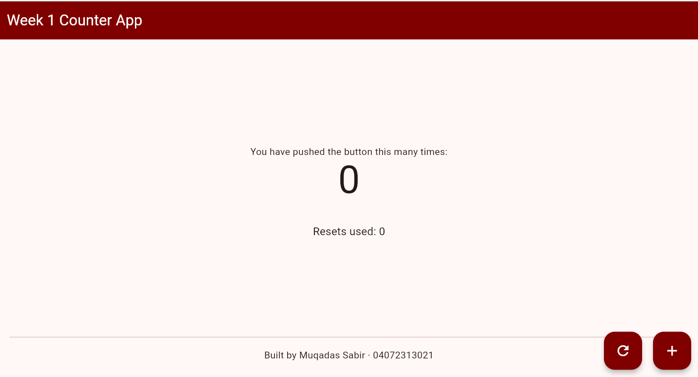

# Week 1 Flutter Counter App

**Student Name:** Muqadas Sabir
**Roll Number:** 04072313021
**Course:** CS 442 - Mobile Application Development

## Features

* Increment counter button
* Reset counter button
* Reset usage tracker
* Personal threshold message
* Personalised Maroon colour theme
* Student name and roll number displayed in the app

## Personal Parameters

* **myThreshold:** 8
* **mySeedColor:** Maroon

## App Screenshot

## Reflection

`setState(() { ... })` tells Flutter that the data inside the StatefulWidget has changed. Flutter then rebuilds the affected part of the user interface so the updated counter and reset values appear on the screen. If a variable is changed without calling `setState()`, Flutter is not notified, so the old value remains visible on the screen.
